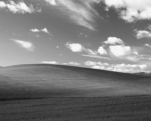
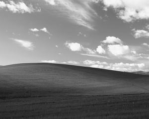

# go-filters 🖼️

This is a simple go project that applies different filters like grayscale black&white to an image.

## Usage

There are several filters you can apply to an image. Here is a start.

The grayscale filter using the weighted coefficients

```console
$ go run main.go ./examples/winxp.png grayscale-coeff
```

The grayscale filter using the average value of the three channels ((R)ed, (G)reen and (B)lue)

```console
$ go run main.go ./examples/winxp.png grayscale-avg
```

The black&white filter

```console
$ go run main.go ./examples/winxp.png bw
```

## Filters

- averaging the RGB components
- weighted sum of the RGB components `Y = 0.299 * R + 0.587 * G + 0.114 * B`

## Examples

Original image


Grayscale using the weighted sum method



Grayscale using the averaging method



## Resources

- https://en.wikipedia.org/wiki/Grayscale
- https://stackoverflow.com/questions/42516203/converting-rgba-image-to-grayscale-golang
